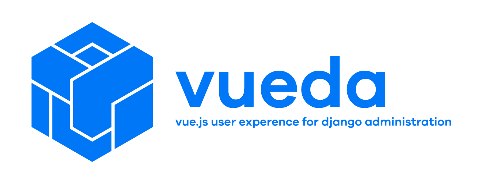

# VUEDA Monorepo



**Server:** [![code style: ruff][]][ruff] [![code style: prettier][]][prettier] ![server pytest status][] ![server coverage status][] ![ruff status][] ![server pysentry status][]

**Client:** [![code style: prettier][]][prettier] ![client tests][] [![client coverage status][]][client coverage] ![eslint][] ![pnpm-audit status][]

Package READMEs:

- [Server](./server/README.md)
- [Client](./client/README.md)
- [Copier Templates](./templates/README.md)

Read [CONTRIBUTING.md](./CONTRIBUTING.md) before opening an issue or pull
request.

<!--prettier-ignore-start-->
<!--TOC-->

- [VUEDA Monorepo](#vueda-monorepo)
  - [About](#about)
  - [Repository Layout](#repository-layout)
  - [Getting Started](#getting-started)
  - [Checks and Tests](#checks-and-tests)
  - [Release Tags](#release-tags)

<!--TOC-->
<!--prettier-ignore-end-->

## About

VUEDA is a two‑part system that pairs a Django REST Framework backend with a Vue.js
component library. The server package (`vueda`) provides DRF views, serializers,
workflow, and permission helpers. The client package (`@arrai-innovations/vueda`)
provides Vue components, composables, and routing helpers that consume the API
and render forms, lists, and detail views dynamically.

## Repository Layout

```text
/
  server/       # Django + DRF package (vueda on PyPI)
  client/       # Vue 3 component library (@arrai-innovations/vueda on npm)
  templates/    # Copier starter templates for integrator repos
  docs/         # VitePress documentation site
  docs-tooling/ # Internal tooling for API doc extraction and rendering
```

## Getting Started

Install pnpm, which is required by just.

```console
npm install -g pnpm@latest-10
```

[Install just via one of the various methods.](https://github.com/casey/just?tab=readme-ov-file#installation)

```console
just bootstrap
```

## Checks and Tests

Read‑only checks:

```console
just check
```

Auto‑fixing:

```console
just fix
```

Tests:

```console
just test
```

## Versions

When a major version number change occurs, you will need to update the dependency information in:

- templates/integrator-monorepo-dx/server/pyproject.toml.jinja
- templates/integrator-monorepo/server/pyproject.toml.jinja

## Release Tags

We use tag prefixes to publish packages independently:

- `server-vX.Y.Z` publishes `vueda` (PyPI)
- `client-vX.Y.Z` publishes `@arrai-innovations/vueda` (npm)

[code style: ruff]: https://img.shields.io/badge/code%20style-ruff-000000.svg?style=for-the-badge
[ruff]: https://docs.astral.sh/ruff/formatter/#style-guide
[code style: prettier]: https://img.shields.io/badge/code_style-prettier-ff69b4.svg?style=for-the-badge
[prettier]: https://github.com/prettier/prettier
[server pytest status]: https://vueda.dev/artifacts/main/server-pytest.svg
[server coverage status]: https://vueda.dev/artifacts/main/server-coverage.svg
[ruff status]: https://vueda.dev/artifacts/main/ruff.svg
[server pysentry status]: https://vueda.dev/artifacts/main/server-pysentry.svg
[client tests]: https://vueda.dev/artifacts/main/client-test.svg
[client coverage status]: https://vueda.dev/artifacts/main/client-test.coverage.svg
[client coverage]: https://vueda.dev/artifacts/main/coverage_client-test/
[eslint]: https://vueda.dev/artifacts/main/eslint.svg
[pnpm-audit status]: https://vueda.dev/artifacts/main/pnpm-audit.svg
