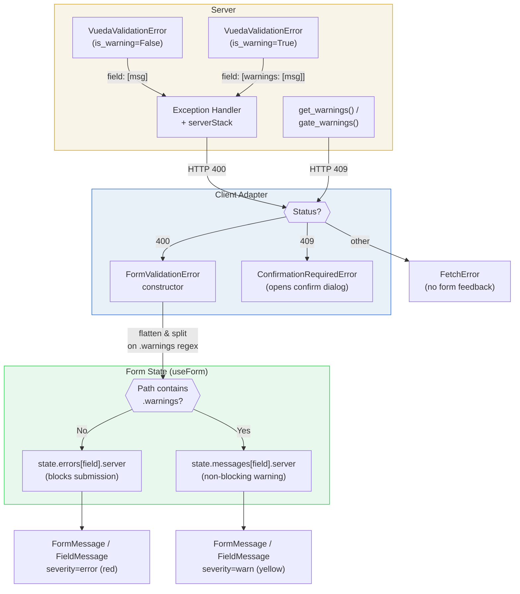

# Error and Validation Contract

VUEDA defines a contract for how validation failures, warnings, and request errors flow from the server to the client and ultimately into form state. The contract spans four boundaries: server exception shaping, HTTP status classification, client error parsing, and form-context ingestion. Understanding where authority resides at each boundary and what happens when a response does not conform is essential for diagnosing validation behaviour.

This page explains the contract itself: what shapes are produced, how they are classified, and where they end up. For the client-side state model that consumes this contract, see [Form State and Validation Lifecycle](./form-state-and-validation-lifecycle). For practical steps on wiring validation into forms, see [Handle Form Validation and Server Errors](../guides/form-validation-and-errors).



<!-- diagram caption="Validation flow from server exception to form feedback rendering" -->

## Boundary and Authority

The server is the sole authority over validation outcomes. It decides what is valid, what is a warning, and what shape the error payload takes. The client is the authority over how those payloads are represented in the runtime state and rendered in the UI. Neither side has visibility into the other's internal logic; they communicate solely through HTTP responses.

The contract has two classification gates. **HTTP 400 means form validation failure**: the client's {@term CRUDL} adapters, auth handlers, and action form components wrap these responses in `FormValidationError` and route them into form state. **HTTP 409 means the server is withholding a write behind a warning confirmation gate**: the client raises `ConfirmationRequiredError`, which `useObjectForm` and `useActionForm` handle by surfacing the warnings and opening a confirm dialog; a confirmed resubmission carries an `Acknowledge-Warnings` header that the server matches to allow the write. All other failures — 5xx errors, 403s, network failures — produce `FetchError`, `ListFilterError`, or resolver-specific classes that follow generic error handling and do not populate form feedback. This means a validation-shaped payload returned with a 500 status will never appear in form fields; a generic 400 from an unrelated endpoint will be treated as validation feedback; and a 409 from a non-confirmation source will be misinterpreted as a warning gate.

## Wire Error Shapes and Status Branches

### The canonical validation shape

Server validation failures are produced by `VuedaValidationError`, which extends DRF's `ValidationError` with two additions: a warning flag and normalization guarantees. The constructor normalizes scalar values into a list and preserves dict/list structures recursively. This means the client can always expect either a field-keyed dict (`{"field": ["message"]}`) or a non-field list (`["message"]`), never a bare string.

The exception handler (`debug_stack_exception_handler`) adds two transformations before the response is sent. First, if the top-level detail is a list (non-field errors), it rewrites it to `{non_field_errors: [...]}` using DRF's `NON_FIELD_ERRORS_KEY` setting. This ensures that non-field errors always arrive under a stable key that the client can look up. Second, it appends a `serverStack` property to the response payload: in DEBUG mode and tests, this includes the full traceback; in production, it includes only the exception text. The client strips `serverStack` from the payload before parsing field paths.

### Warning wire format

When `VuedaValidationError` is constructed with `is_warning=True`, the detail is wrapped in a `{"warnings": [...]}` structure through the `get_error_details_as_warning` helper. The exception code is set to `"warning"` instead of the default `"error"`. On the wire, a warning payload for a field looks like:

```json
{ "field_name": [{ "warnings": ["Be careful about this value"] }] }
```

While a standard error for the same field looks like:

```json
{ "field_name": ["This value is invalid."] }
```

A single response can contain both errors and warnings for different fields, or even mixed entries for the same field. The client parser uses the structural presence of `.warnings` in the flattened path to distinguish them; it does not inspect error codes.

Warning-only exceptions receive special treatment in production: the exception handler checks `contains_only_warnings(exc)` and, if true, skips Sentry capture and database logging. The default logging configuration also includes a `FilterOutVuedaValidationWarnings` filter that suppresses warning-only validation from file logging. This reflects the design intent: warnings are informational feedback, not application errors.

### Input-shape rejection

VUEDA deliberately deviates from DRF's default behaviour for unknown fields in requests. Where DRF silently ignores unrecognized input fields, VUEDA rejects them. This policy is motivated by a practical concern: silent acceptance of unknown fields can lead developers to believe their data is being persisted when it is not.

The rejection operates at two layers:

**At the serializer layer**, `NoExtraFieldsSerializerMixin` (included in `VuedaSerializer`) overrides `validate()` to compare the incoming `initial_data` keys against the serializer's declared `fields`. Unknown input fields produce a field-keyed 400 response: `{"unknown_field": ["Invalid field. Valid fields are ..."]}`. The mixin also checks `expand` parameters at the serializer level, comparing requested expands against `expandable_fields`. These rejections are field-keyed 400s that map cleanly to `FormValidationError` on the client.

The mixin is aware of complex field name syntax; it parses bracket-indexed (`items[0]quantity`) and dot-delimited (`items.quantity`) names to extract the base field for comparison. It also intentionally skips validation for nested serializers (checking whether the serializer is the top-level one for the view), avoiding redundant checks on child serializers.

**At the viewset layer**, `NoExtraFieldsForViewSetMixin` (included in `VuedaViewSet`) validates query parameters on list and `retrieve` actions. This validation has two distinct paths with different error behaviours:

For flex-field parameters (`f` for fields, `e` for expands), the mixin calls `validate_flex_expand_and_field_param`. Invalid field or `expand` names produce field-keyed 400 responses (`{"invalid_field": [...]}` or `{"invalid_expand": [...]}`), which map to `FormValidationError` on the client. The expand validation accounts for action-specific `permitted_expands` context, allowing different actions to permit different `expand` sets.

For filter query parameters (on `list` actions), the mixin builds an allowlist from the filterset class's declared filters, plus recognized framework parameters (pagination, ordering, search, flex-fields). Unknown query parameters that do not match any declared filter raise a `VuedaValidationError` with a field-keyed 400 response: `{"unknown_param": ["Invalid query parameter.  Valid filters are ..."]}`. All unrecognized parameters are reported in a single response. This is consistent with flex-field validation and NoExtraFieldsSerializerMixin. The client sees a `FormValidationError` and can route the errors into the form state.

The `om` (omit) flex-field parameter is an additional asymmetry: it is recognized as a valid query parameter (not rejected as unknown), but its values are not validated against the serializer's field list at either the serializer or viewset layer.

## Non-Field and Nested Path Semantics

The client preserves field paths from the server payload as-is in form state. A server error keyed by `address.city` becomes `state.errors["address.city"]`. A server error for an array item keyed by `items[0].quantity` becomes `state.errors["items[0].quantity"]`. The client does not parse or decompose these paths; they are treated as opaque string keys.

Non-field errors use the stable key `non_field_errors`, defined by DRF's `NON_FIELD_ERRORS_KEY` setting. The server's exception handler ensures this key is used even when the original exception was a bare list. On the client, `NON_FIELD_ERRORS_KEY` is mirrored as a constant, and form feedback components check for it specifically when rendering form-level (non-field) feedback.

The `FormValidationError` constructor flattens the response payload into paths using a recursive path-flattening utility. This handles nested dicts and arrays: `{"items": [{"quantity": ["Too large"]}]}` flattens to a path like `items[0].quantity[0]`, which is then normalized to `items[0].quantity` for the error map key. The flattening also handles structured objects: a path ending in `.detail` indicates a structured feedback object rather than a string message, and the parent path (without `.detail`) is used as the key.

## {@term Warning Channel} Semantics

The warning channel is a parallel transport mechanism that uses the same HTTP 400 status and the same `FormValidationError` parsing path as errors, but routes to a different destination in form state.

On the server, `VuedaValidationError(detail, is_warning=True)` wraps the detail through `get_error_details_as_warning`, which produces `{"warnings": [...]}` structures at the leaf level. On the client, `FormValidationError` detects these by testing each flattened path against the regex `/\.warnings(\[\d+\])?/`. Matching paths are collected as warning paths; non-matching paths are collected as error paths. Warning paths have the `.warnings` segment stripped during normalization so that the resulting key maps to the same field name as an error would.

The two maps, `FormValidationError.errors` and `FormValidationError.messages`, are then ingested into form state separately: errors go to `state.errors[name].server`, messages go to `state.messages[name].server`. This separation is what makes warnings non-blocking: the submission pipeline checks only `state.errors`, so `state.messages` entries never prevent submission.

A response can contain both errors and warnings. The parser processes them independently; there is no mutual exclusion. A field can have a blocking error and a non-blocking warning simultaneously, and both will be visible in the form UI (as error-severity and warning-severity feedback, respectively).

## Warning Confirmation Gate (HTTP 409)

The warning confirmation gate is a distinct transport path from the 400 validation channel. A 409 response signals that the write has been withheld because unacknowledged warnings exist: the submitted data was valid, the server is waiting for explicit user consent before proceeding.

On the server, the gate activates when the write request carries no `Acknowledge-Warnings` header and warnings are present. For create and update operations, `VuedaViewSet` calls the serializer's `get_warnings()` hook after `validate()` succeeds. For destroy, activate/deactivate, and bulk deletes, the viewset's own `get_warnings(action, objs)` hook runs. Custom action bodies call `gate_warnings(request, warnings)` directly after input validation. When warnings are present and unacknowledged, the viewset responds:

```json
{
    "confirmation_required": true,
    "digest": "<sha256-of-warning-payload>",
    "warnings": { "field": ["message"] }
}
```

with HTTP 409. Nothing is written; the response is always pre-commit.

On the client, the CRUDL mutation adapters classify 409 responses as `ConfirmationRequiredError`. This error carries the server's `digest` and a `FormValidationError` pre-built from the `warnings` payload. `useObjectForm` and `useActionForm` catch `ConfirmationRequiredError` and ingest the nested `FormValidationError` into form state (populating `state.messages` via `handleServerFormValidationError`), then open the `confirmation` controller. A `FormConfirmDialog` bound to the controller presents the warnings and waits for user input. Confirming reruns the submit with the digest as the `Acknowledge-Warnings` request header; cancelling resolves as cancelled with the warnings left visible.

The digest is a SHA-256 hash of the serialized warning mapping. If the warning content changes between the first 409 and the confirmed retry — because database state changed, or because the submitted input changed — the server rejects the stale digest and responds with a fresh 409 carrying a new digest and updated warnings. The user is re-prompted until they confirm the current warning text or cancel.

The 409 path is separate from the 400 validation path at every layer. The exception class is `ConfirmationRequiredError`, not `FormValidationError`. The form state effects land in `state.messages`, not `state.errors`. Two write paths are excluded from the warning gate: bulk/list-serializer create and update saves, and workflow transitions.

## Client Classification and Form-State Ingestion

Client CRUDL adapters (`objectCrud` for `create`/`update`/`delete`, `listCrud` for bulk delete, `storeUser` for authentication, `ModelActionForm` for action execution) follow two classification rules: HTTP 400 becomes `FormValidationError`, HTTP 409 becomes `ConfirmationRequiredError`, and everything else becomes `FetchError` or a more specific non-form error class. The authentication adapter (`storeUser`) does not observe the 409 path; login is not subject to warning confirmation.

`FormValidationError` construction happens at the adapter layer, before the error reaches any form-context handler. The constructor:

1. Strips `serverStack` from the payload and stores it separately.
2. Flattens the remaining payload into paths.
3. Splits paths into warning and non-warning sets using the warnings regex.
4. Extracts structured-object paths (those with a `.detail` suffix) and string paths.
5. Builds the `errors` map from non-warning paths and the `messages` map from warning paths.

Form context ingestion occurs when `handleServerFormValidationError(error)` is called. This iterates `error.errors` and `error.messages`, writing each entry under the `server` code key. The `server` code is what distinguishes server-originated feedback from local validation (`required`, `validate`) in the two-dimensional error storage.

The `server` code is reserved and runtime-enforced in client form APIs. Local calls that try to write `server` through `updateError` or `updateMessage` throw; only `handleServerFormValidationError` is allowed to populate that namespace.

`clearServerErrors(name, dependents)` is the selective clearing mechanism. It deletes only the `server` code for a given field (from both errors and messages), then recurses through dependent paths. The `$parent` placeholder in dependent paths resolves to the dot-delimited parent of the current field's name, enabling sibling-field clearing in nested/array structures.

First-error resolution (`getFirstErrorField`) scans the error map in a defined priority order: `non_field_errors` first, then displayed fields in their declared order. For array fields, it expands the search to bracket-keyed paths. For fields using `__`-delimited nesting conventions, it resolves the parent array and searches nested keys within items. This ensures that first-error scroll navigation reaches the correct DOM element regardless of how the error path is structured.

## Permission and Not-Found Branches

Not all server error responses participate in the validation contract. Some endpoints use non-400 status codes for failures that are structurally different from validation.

The choices and filter-choices endpoints (`ModelInfoChoicesViewSet`, `ModelInfoFilterSetChoicesViewSet`) under {@term Model Info} use **404** for invalid model, field, or filter identifiers, and **403** for permission denials. These are not validation failures; they indicate that the requested resource does not exist or is inaccessible. On the client, these responses produce `FetchError` instances (not `FormValidationError`), which are surfaced through generic error handling rather than form feedback.

This means that a form component fetching choices for a field that references an invalid model will not see a validation error in the form UI. The error will appear in whatever error boundary or catch handler the component uses for `FetchError`, which is typically a toast or a loading-error state rather than field-level feedback.

## Observable Failure Signatures

**Non-object response payloads.** `FormValidationError` assumes an object-like payload (`const data = { ...responseData }`). If the server returns a non-object 400 response (for example, a bare string or an array), the spread produces unexpected keys or an empty object, and the resulting error/message maps may be sparse or empty.

**Warning-only responses on form-validation transport.** A response containing only warnings still uses HTTP 400 and still arrives as a `FormValidationError`. The client routes all entries to `.messages` (none to `.errors`), so the form will not show any blocking errors. However, callers that treat any `FormValidationError` as a hard failure (without checking the error/message split) may incorrectly block the user.

**Warning confirmation 409 mishandled as a generic error.** A 409 response from a warning gate is not a `FormValidationError`; it is a `ConfirmationRequiredError`. Code that catches only `FormValidationError` will miss the 409 and surface it through `FetchError` handling, leaving the user with no confirmation prompt. Code that treats any `ConfirmationRequiredError` as a hard failure without checking the confirm path will silently cancel the write.

**Non-field errors with no `FormMessage`.** `non_field_errors` entries are rendered by `FormMessage` placed inside a form context. Field-scope `FieldMessage` instances do not pick up non-field errors. If a form does not include a `FormMessage`, non-field errors will appear in state but be invisible in the UI.

**Choices endpoint 404 vs validation 400.** A missing or invalid model/field/filter on a choices endpoint returns 404, not 400. Code that only handles `FormValidationError` will miss these failures. The error surfaces as a `FetchError` and must be caught separately.

**Omit parameter not validated.** The `om` flex-field parameter is accepted as a recognized query parameter but its values are not checked against the serializer's field list. Invalid `omit` values pass through silently rather than producing a validation error.

## Relevant Implementation Surface

- {@api py:module:vueda.core.exceptions}
- {@api py:function:vueda.core.exceptions.debug_stack_exception_handler}
- {@api py:class:vueda.core.exceptions.VuedaValidationError}
- {@api py:class:vueda.core.serializers.NoExtraFieldsSerializerMixin}
- {@api py:function:vueda.core.serializers.NoExtraFieldsSerializerMixin.validate}
- {@api py:class:vueda.core.viewsets.NoExtraFieldsForViewSetMixin}
- {@api py:function:vueda.core.viewsets.NoExtraFieldsForViewSetMixin.validate_flex_expand_and_field_param}
- {@api py:function:vueda.core.viewsets.NoExtraFieldsForViewSetMixin.list}
- {@api py:class:vueda.info.viewsets.ModelInfoChoicesBaseViewSet}
- {@api py:function:vueda.info.viewsets.ModelInfoChoicesBaseViewSet.check_permissions}
- {@api py:function:vueda.info.viewsets.ModelInfoChoicesViewSet.validate_queryset}
- {@api py:function:vueda.info.viewsets.ModelInfoFilterSetChoicesViewSet.validate_queryset}
- {@api rest:endpoint:GET:/vueda.info/model_info_choices/{app_label}/{model}/{field}/}
- {@api rest:endpoint:GET:/vueda.info/model_info_filter_choices/{app_label}/{model}/{field}/}
- {@api js:module:@arrai-innovations/vueda/utils/errors}
- {@api js:class:@arrai-innovations/vueda/utils/errors#FormValidationError}
- {@api js:property:@arrai-innovations/vueda/utils/errors#FormValidationError.errors}
- {@api js:property:@arrai-innovations/vueda/utils/errors#FormValidationError.messages}
- {@api js:property:@arrai-innovations/vueda/utils/errors#FormValidationError.serverStack}
- {@api js:module:@arrai-innovations/vueda/utils/objectCrud}
- {@api js:module:@arrai-innovations/vueda/utils/listCrud}
- {@api js:module:@arrai-innovations/vueda/stores/storeUser}
- {@api js:class:@arrai-innovations/vueda/utils/errors#ConfirmationRequiredError}
- {@api js:module:@arrai-innovations/vueda/use/useForm}
- {@api js:property:@arrai-innovations/vueda/use/useForm#FormContext.handleServerFormValidationError}
- {@api js:property:@arrai-innovations/vueda/use/useForm#FormContext.clearServerErrors}
- {@api js:property:@arrai-innovations/vueda/use/useForm#FormContext.getFirstErrorField}
- {@api js:function:@arrai-innovations/vueda/use/useObjectForm#defaultOnSubmissionError}
- {@api js:property:@arrai-innovations/vueda/utils/constants#NON_FIELD_ERRORS_KEY}
- {@api vue:component:ActionForm}
- {@api vue:component:ModelActionForm}
- {@api py:class:vueda.core.viewsets.WarningConfirmationMixin}
- {@api py:function:vueda.core.exceptions.gate_warnings}
