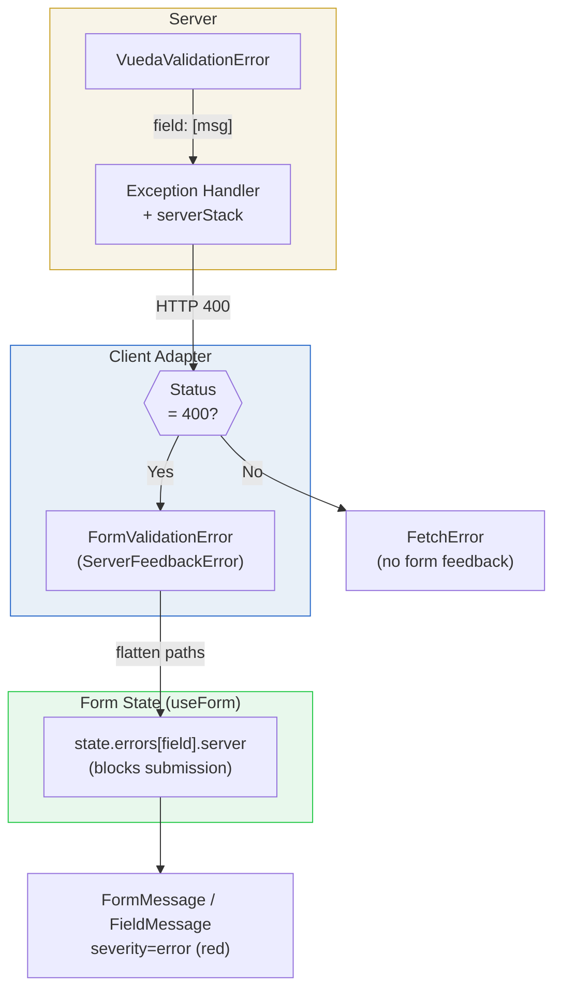

# Error and Validation Contract

VUEDA defines a contract for how validation failures, warnings, and request errors flow from the server to the client and ultimately into form state. The contract spans four boundaries: server exception shaping, HTTP status classification, client error parsing, and form-context ingestion. Understanding where authority resides at each boundary and what happens when a response does not conform is essential for diagnosing validation behaviour.

This page explains the contract itself: what shapes are produced, how they are classified, and where they end up. For the client-side state model that consumes this contract, see [Form State and Validation Lifecycle](./form-state-and-validation-lifecycle). For practical steps on wiring validation into forms, see [Handle Form Validation and Server Errors](../guides/form-validation-and-errors).

<!-- diagram caption="Validation flow from server exception to form feedback rendering" -->

## Boundary and Authority

The server is the sole authority over validation outcomes. It decides what is valid, what is a warning, and what shape the error payload takes. The client is the authority over how those payloads are represented in the runtime state and rendered in the UI. Neither side has visibility into the other's internal logic; they communicate solely through HTTP responses.

The contract has a single classification gate in the default transport: **HTTP 400 means form validation; everything else does not.** This constraint is deliberate. The client's {@term CRUDL} adapters, auth handlers, and action form components all share one rule. They wrap 400 responses in `FormValidationError` and route them into form state. `FormValidationError` extends `ServerFeedbackError`, the public base class for feedback errors the form system can ingest.

Non-400 failures (`FetchError`, `ListFilterError`, or resolver-specific classes) follow generic error handling paths. They do not populate form feedback. A validation-shaped 500 will not appear in form fields unless a custom adapter converts it to a `ServerFeedbackError` subclass. The default adapters treat any 400 as validation feedback, even when the payload is generic.

## Wire Error Shapes and Status Branches

### The canonical validation shape

Server validation failures are produced by `VuedaValidationError`, which extends DRF's `ValidationError` with normalization guarantees. The constructor normalizes scalar values into a list and preserves dict/list structures recursively. This means the client can always expect either a field-keyed dict (`{"field": ["message"]}`) or a non-field list (`["message"]`), never a bare string.

The exception handler (`debug_stack_exception_handler`) adds two transformations before the response is sent. First, if the top-level detail is a list (non-field errors), it rewrites it to `{non_field_errors: [...]}` using DRF's `NON_FIELD_ERRORS_KEY` setting. This ensures that non-field errors always arrive under a stable key that the client can look up. Second, it appends a `serverStack` property to the response payload: in DEBUG mode and tests, this includes the full traceback; in production, it includes only the exception text. The client strips `serverStack` from the payload before parsing field paths.

### Input-shape rejection

VUEDA deliberately deviates from DRF's default behaviour for unknown fields in requests. Where DRF silently ignores unrecognized input fields, VUEDA rejects them. This policy is motivated by a practical concern: silent acceptance of unknown fields can lead developers to believe their data is being persisted when it is not.

The rejection operates at two layers:

**At the serializer layer**, `NoExtraFieldsSerializerMixin` (included in `VuedaSerializer`) overrides `validate()` to compare the incoming `initial_data` keys against the serializer's declared `fields`. Unknown input fields produce a field-keyed 400 response: `{"unknown_field": ["Invalid field. Valid fields are ..."]}`. The mixin also checks `expand` parameters at the serializer level, comparing requested expands against `expandable_fields`. These rejections are field-keyed 400s that map cleanly to `FormValidationError` on the client.

The mixin is aware of complex field name syntax; it parses bracket-indexed (`items[0]quantity`) and dot-delimited (`items.quantity`) names to extract the base field for comparison. It also intentionally skips validation for nested serializers (checking whether the serializer is the top-level one for the view), avoiding redundant checks on child serializers.

**At the viewset layer**, `NoExtraFieldsForViewSetMixin` (included in `VuedaViewSet`) validates query parameters on list and `retrieve` actions. This validation has two distinct paths with different error behaviours:

For flex-field parameters (`f` for fields, `e` for expands), the mixin calls `validate_flex_expand_and_field_param`. Invalid field or `expand` names produce field-keyed 400 responses (`{"invalid_field": [...]}` or `{"invalid_expand": [...]}`), which map to `FormValidationError` on the client. The expand validation accounts for action-specific `permitted_expands` context, allowing different actions to permit different `expand` sets.

For filter query parameters (on `list` actions), the mixin builds an allowlist from the filterset class's declared filters, plus recognized framework parameters (pagination, ordering, search, flex-fields). Unknown query parameters that do not match any declared filter raise a `VuedaValidationError` with a field-keyed 400 response: `{"unknown_param": ["Invalid query parameter.  Valid filters are ..."]}`. All unrecognized parameters are reported in a single response. This is consistent with flex-field validation and NoExtraFieldsSerializerMixin. The client sees a `FormValidationError` and can route the errors into the form state.

The `om` (omit) flex-field parameter is an additional asymmetry: it is recognized as a valid query parameter (not rejected as unknown), but its values are not validated against the serializer's field list at either the serializer or viewset layer.

## Non-Field and Nested Path Semantics

The client preserves field paths from the server payload as-is in form state. A server error keyed by `address.city` becomes `state.errors["address.city"]`. A server error for an array item keyed by `items[0].quantity` becomes `state.errors["items[0].quantity"]`. The client does not parse or decompose these paths; they are treated as opaque string keys.

Non-field errors use the stable key `non_field_errors`, defined by DRF's `NON_FIELD_ERRORS_KEY` setting. The server's exception handler ensures this key is used even when the original exception was a bare list. On the client, `NON_FIELD_ERRORS_KEY` is mirrored as a constant, and form feedback components check for it specifically when rendering form-level (non-field) feedback.

The `FormValidationError` constructor flattens the response payload into paths using a recursive path-flattening utility. This handles nested dicts and arrays: `{"items": [{"quantity": ["Too large"]}]}` flattens to a path like `items[0].quantity[0]`, which is then normalized to `items[0].quantity` for the error map key. The flattening also handles structured objects: a path ending in `.detail` indicates a structured feedback object rather than a string message, and the parent path (without `.detail`) is used as the key.

## {@term Warning Channel} Semantics

Advisory warnings are not part of the HTTP 400 / `FormValidationError` contract described above; they use a separate status code and error class. Every warnings source — a serializer's `get_warnings()`, the viewset-level `get_warnings_for_object`/`get_warnings` hooks, `get_transition_warnings`, or a bare `gate_warnings` call — returns one of exactly two shapes:

- **Aggregate**: `{field: [messages]}`, for a single object. Use `non_field_errors` for a warning not tied to a field. A serializer's `get_warnings()` always uses this shape — create/update has no bulk/list variant, so there is no other object to attribute a warning to. `get_warnings_for_object(action, obj)` and `get_transition_warnings(transition, user)` are likewise single-instance hooks that always return this shape for their one instance.
- **Per-object**: `{object_id: {field: [messages]}}`, for a bulk request — one entry per warned object, keyed by `str(pk)`, so the response can attribute each warning back to the object that triggered it. Only the framework builds this shape, by calling the single-instance hook above once per instance and nesting each result under its object id: `WarningConfirmationMixin`'s default `get_warnings(action, objs)` does this for `get_warnings_for_object`, and `WorkflowViewSet.execute_transition` does it for `get_transition_warnings`.

Which shape a request gets is decided by which hook handled it, never by counting the objects a request happens to affect — a bulk request can affect exactly one object and still gets the per-object shape, because it went through `get_warnings`/`execute_transition`'s bulk path rather than the single-instance hook.

None of these hooks enforce this shape in code: `gate_warnings` only checks the mapping for truthiness and digests it as opaque JSON, so nothing raises if a caller returns something else. But the client's default rendering (below) only understands these two shapes; a caller that deviates is expected to also supply its own client-side rendering to interpret whatever it returns instead. When the mapping is non-empty and the request has not acknowledged it, the write is withheld and the response is `409 Conflict` with `{"confirmation_required": true, "digest": ..., "warnings": {...}}` instead of a 400.

The client parses this 409 into a `ConfirmationRequiredError`, which also extends `ServerFeedbackError`. It populates `.messages` directly from the response's `warnings` mapping. It leaves `.errors` empty, since a confirmation response carries no blocking errors. `handleServerFormValidationError(error)` ingests the shared base-class shape without branching: it reads `error.errors` into `state.errors[name].server` and `error.messages` into `state.messages[name].server`.

Callers still branch on class before ingestion. `FormValidationError` and custom `ServerFeedbackError` subclasses use the blocking-feedback path. `ConfirmationRequiredError` uses the confirm-then-resubmit path when it carries a digest.

The response gives the client no way to infer which of the two shapes `.messages` is in from the payload alone — a per-object mapping and a plain field-keyed mapping are both just JSON objects. So `ConfirmationRequiredError` also carries `.bulk`: `true` for the per-object shape, `false` for the aggregate shape. This is not derived from the response body; it is set by whichever client call constructed the error, because that call is the only place that knows which request path (single-object or bulk) it took.

`.bulk` flows alongside `.messages` through the rest of the rendering chain: `useConfirmationController`'s `request(messages, { bulk })` stores it as `confirmation.bulk`, and `FormConfirmDialog` exposes it on its `warnings` slot scope (`{ warnings, flatWarnings, bulk }`) next to the mapping itself. `FormConfirmDialog` otherwise treats `warnings` as opaque: its default rendering flattens every value into a plain message list and never resolves a field name or an object id. A view that wants shape-aware rendering — field headers, or grouping a bulk action's per-object shape by the object it belongs to — resolves that itself: `ViewCreate` and `ViewUpdate` render the aggregate shape via `FieldWarningsList`; `ModelActionForm` overrides the same slot to group the per-object shape, reading `bulk` from the slot scope to decide whether to group at all, then resolving each object id to a display label before handing that object's field-keyed warnings to `FieldWarningsList` too.

See [Form State and Validation Lifecycle](./form-state-and-validation-lifecycle#the-warning-channel) for the full confirm-then-resubmit lifecycle, and [Handle Form Validation and Server Errors](../guides/form-validation-and-errors#warnings-that-require-confirmation) for implementation steps on both sides.

## Client Classification and Form-State Ingestion

Client CRUDL adapters all follow the same classification rule. This includes `objectCrud` for object mutations, `listCrud` for bulk delete, `storeUser` for authentication, and `ModelActionForm` for action execution. HTTP 400 becomes `FormValidationError`. Everything else becomes `FetchError` or a more specific non-form error class. Custom adapters that replace the transport can throw a `ServerFeedbackError` subclass. Use that when custom blocking feedback should enter the same form-state ingestion path.

`FormValidationError` construction happens at the adapter layer, before the error reaches any form-context handler. The constructor:

1. Strips `serverStack` from the payload and stores it separately.
2. Flattens the remaining payload into paths.
3. Extracts structured-object paths (those with a `.detail` suffix) and string paths.
4. Builds the `errors` map from all paths. `messages` is always empty.

Call `handleServerFormValidationError(error)` with a `ServerFeedbackError` to ingest form feedback. The method iterates `error.errors` and `error.messages`, writing each entry under the `server` code key. The `server` code distinguishes server-originated feedback from local validation (`required`, `validate`) in the two-dimensional error storage.

The `server` code is reserved and runtime-enforced in client form APIs. Local calls that try to write `server` through `updateError` or `updateMessage` throw; only `handleServerFormValidationError` is allowed to populate that namespace.

`clearServerErrors(name, dependents)` is the selective clearing mechanism. It deletes only the `server` code for a given field (from both errors and messages), then recurses through dependent paths. The `$parent` placeholder in dependent paths resolves to the dot-delimited parent of the current field's name, enabling sibling-field clearing in nested/array structures.

First-error resolution (`getFirstErrorField`) scans the error map in a defined priority order: `non_field_errors` first, then displayed fields in their declared order. For array fields, it expands the search to bracket-keyed paths. For fields using `__`-delimited nesting conventions, it resolves the parent array and searches nested keys within items. This ensures that first-error scroll navigation reaches the correct DOM element regardless of how the error path is structured.

## Permission and Not-Found Branches

Not all server error responses participate in the validation contract. Some endpoints use non-400 status codes for failures that are structurally different from validation.

The choices and filter-choices endpoints (`ModelInfoChoicesViewSet`, `ModelInfoFilterSetChoicesViewSet`) under {@term Model Info} use **404** for invalid model, field, or filter identifiers, and **403** for permission denials. These are not validation failures; they indicate that the requested resource does not exist or is inaccessible. On the client, these responses produce `FetchError` instances (not `FormValidationError`), which are surfaced through generic error handling rather than form feedback.

This means that a form component fetching choices for a field that references an invalid model will not see a validation error in the form UI. The error will appear in whatever error boundary or catch handler the component uses for `FetchError`, which is typically a toast or a loading-error state rather than field-level feedback.

## Observable Failure Signatures

**Non-object response payloads.** `FormValidationError` assumes an object-like payload (`const data = { ...responseData }`). If the server returns a non-object 400 response (for example, a bare string or an array), the spread produces unexpected keys or an empty object, and the resulting error/message maps may be sparse or empty.

**Non-field errors with no `FormMessage`.** `non_field_errors` entries are rendered by `FormMessage` placed inside a form context. Field-scope `FieldMessage` instances do not pick up non-field errors. If a form does not include a `FormMessage`, non-field errors will appear in state but be invisible in the UI.

**Choices endpoint 404 vs validation 400.** A missing or invalid model/field/filter on a choices endpoint returns 404, not 400. Code that only handles `FormValidationError` will miss these failures. The error surfaces as a `FetchError` and must be caught separately.

**Omit parameter not validated.** The `om` flex-field parameter is accepted as a recognized query parameter but its values are not checked against the serializer's field list. Invalid `omit` values pass through silently rather than producing a validation error.

## Relevant Implementation Surface

- {@api py:module:vueda.core.exceptions}
- {@api py:function:vueda.core.exceptions.debug_stack_exception_handler}
- {@api py:class:vueda.core.exceptions.VuedaValidationError}
- {@api py:class:vueda.core.serializers.NoExtraFieldsSerializerMixin}
- {@api py:function:vueda.core.serializers.NoExtraFieldsSerializerMixin.validate}
- {@api py:class:vueda.core.viewsets.NoExtraFieldsForViewSetMixin}
- {@api py:function:vueda.core.viewsets.NoExtraFieldsForViewSetMixin.validate_flex_expand_and_field_param}
- {@api py:function:vueda.core.viewsets.NoExtraFieldsForViewSetMixin.list}
- {@api py:class:vueda.info.viewsets.ModelInfoChoicesBaseViewSet}
- {@api py:function:vueda.info.viewsets.ModelInfoChoicesBaseViewSet.check_permissions}
- {@api py:function:vueda.info.viewsets.ModelInfoChoicesViewSet.validate_queryset}
- {@api py:function:vueda.info.viewsets.ModelInfoFilterSetChoicesViewSet.validate_queryset}
- {@api rest:endpoint:GET:/vueda.info/model_info_choices/{app_label}/{model}/{field}/}
- {@api rest:endpoint:GET:/vueda.info/model_info_filter_choices/{app_label}/{model}/{field}/}
- {@api js:module:@arrai-innovations/vueda/utils/errors}
- {@api js:class:@arrai-innovations/vueda/utils/errors#ServerFeedbackError}
- {@api js:class:@arrai-innovations/vueda/utils/errors#FormValidationError}
- {@api js:class:@arrai-innovations/vueda/utils/errors#ConfirmationRequiredError}
- {@api js:property:@arrai-innovations/vueda/utils/errors#FormValidationError.errors}
- {@api js:property:@arrai-innovations/vueda/utils/errors#FormValidationError.messages}
- {@api js:property:@arrai-innovations/vueda/utils/errors#FormValidationError.serverStack}
- {@api js:class:@arrai-innovations/vueda/utils/errors#ConfirmationRequiredError}
- {@api js:property:@arrai-innovations/vueda/utils/errors#ConfirmationRequiredError.digest}
- {@api js:property:@arrai-innovations/vueda/utils/errors#ConfirmationRequiredError.messages}
- {@api js:property:@arrai-innovations/vueda/utils/errors#ConfirmationRequiredError.bulk}
- {@api js:module:@arrai-innovations/vueda/utils/objectCrud}
- {@api js:module:@arrai-innovations/vueda/utils/listCrud}
- {@api js:module:@arrai-innovations/vueda/stores/storeUser}
- {@api js:module:@arrai-innovations/vueda/stores/storeWorkflow}
- {@api js:module:@arrai-innovations/vueda/use/useConfirmationController}
- {@api js:module:@arrai-innovations/vueda/use/useForm}
- {@api js:property:@arrai-innovations/vueda/use/useForm#FormContext.handleServerFormValidationError}
- {@api js:property:@arrai-innovations/vueda/use/useForm#FormContext.clearServerErrors}
- {@api js:property:@arrai-innovations/vueda/use/useForm#FormContext.getFirstErrorField}
- {@api js:function:@arrai-innovations/vueda/use/useObjectForm#defaultOnSubmissionError}
- {@api js:property:@arrai-innovations/vueda/utils/constants#NON_FIELD_ERRORS_KEY}
- {@api vue:component:ActionForm}
- {@api vue:component:ModelActionForm}
- {@api vue:component:FormConfirmDialog}
