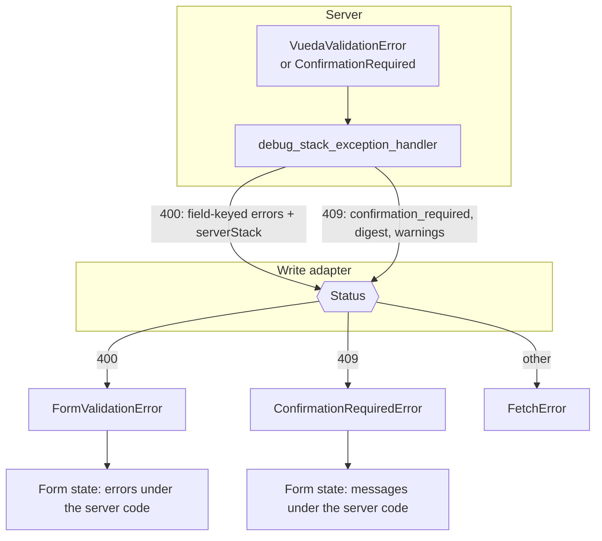

# Error and Validation Contract

This page describes the error bodies that VUEDA's server sends and the client error classes that parse them. It covers the `400` validation body, the `409` body of {@term Warning Confirmation}, and the class that each {@term CRUD Adapter} throws for each status. [Form State and Validation Lifecycle](./form-state-and-validation-lifecycle.md) describes how a form stores these errors and runs the confirmation. [Handle Form Validation and Server Errors](../guides/form-validation-and-errors.md) and [Require Confirmation Before a Write](../guides/require-write-confirmation.md) give the steps.


```mermaid
flowchart TD
    subgraph Server
        RAISE["VuedaValidationError<br/>or ConfirmationRequired"]
        EH["debug_stack_exception_handler"]
    end

    RAISE --> EH
    EH -- "400: field-keyed errors + serverStack" --> GATE
    EH -- "409: confirmation_required, digest, warnings" --> GATE

    subgraph Client["Write adapter"]
        GATE{{"Status"}}
    end

    GATE -- "400" --> FVE["FormValidationError"]
    GATE -- "409" --> CRE["ConfirmationRequiredError"]
    GATE -- "other" --> FE["FetchError"]

    FVE --> ERR["Form state: errors under the server code"]
    CRE --> MSG["Form state: messages under the server code"]
```

<!-- diagram caption="How a write's validation error or warning travels from the server to form state" -->

## Boundary and Authority

The server decides what is valid, what is a warning, and the shape of each error body. The client decides how it stores and shows those bodies. The two sides share only the HTTP status and the JSON body.

A write adapter reads the status first. A `400` carries validation feedback, and a `409` carries warnings that need confirmation. Any other failure is a generic error that never enters form state. Read requests follow different rules, which [Client Classification and Form-State Ingestion](#client-classification-and-form-state-ingestion) lists.

## Wire Error Shapes and Status Branches

The generated REST pages do not declare the validation `400` body or the `409` confirmation body ([#376](https://github.com/arrai-innovations/vueda/issues/376), [#145](https://github.com/arrai-innovations/vueda/issues/145)). Some of their error examples do not match what the server sends ([#238](https://github.com/arrai-innovations/vueda/issues/238)). This section describes the bodies that the server sends.

### The validation shape

VUEDA's validation code raises {@api py:class:vueda.core.exceptions.VuedaValidationError}, a subclass of {@api ext:drf:rest_framework.exceptions.ValidationError}. A field-keyed error is a JSON object whose keys are field names, such as `{"name": ["Too long."]}`. The value is usually a list of messages, and a plain string also reaches the client under its field name. An error raised with a single message or a list becomes a {@term Non-Field Error}.

{@api py:function:vueda.core.exceptions.debug_stack_exception_handler} shapes every error body before the server sends it:

- A validation error whose detail is a list moves under the `non_field_errors` key: `{"non_field_errors": ["..."]}`.
- Every error body gets a `serverStack` string. Under `DEBUG`, or when the `IN_TESTS` setting is true, it holds the full traceback. Otherwise it holds the exception class and message.
- An exception that DRF does not handle becomes a `500` with a `detail` message and `serverStack`.

The `409` confirmation body is the one response without `serverStack`. The handler also marks the request's transaction for rollback before it answers, as [Configuration Surface and Defaults](./configuration-surface-and-defaults.md#request-transactions) describes.

A `400` that is not a validation error carries a `detail` string: `{"detail": "..."}`. Malformed JSON produces one, and so does {@api py:class:vueda.core.exceptions.BadRequestException}.

### Unknown input fields

{@api py:class:vueda.core.serializers.NoExtraFieldsSerializerMixin}, part of {@api py:class:vueda.core.serializers.VuedaSerializer}, rejects a write body key that the view's serializer does not declare. Each unknown key gets its own entry with the message `Invalid field.  Valid fields are ...`. The mixin checks a key such as `items[0]quantity` or `items.quantity` by its base name, `items`. It does not check keys inside a nested serializer's payload. It always accepts `formatted_name` on a model that has one.

A write action also rejects an `e` value that it does not permit, in the same shape and before it validates the body. [Field and Expand Semantics](./field-and-expand-semantics.md) describes which expands each action permits.

On `list` and `retrieve`, the server rejects unknown query parameters, as [Filtering and Ordering Semantics](./filtering-and-ordering-semantics.md#query-namespace-and-validation-boundary) describes ({@term Query Parameter Validation}). An invalid `f` or `e` name on a read returns the same shape, keyed by `f` and `e`, with `serverStack`. One response reports the invalid names in both parameters.

### Other error statuses

A `403` or `404` from a VUEDA view carries `{"detail": "..."}` plus `serverStack`. These statuses never carry validation feedback. For example, the choices endpoints answer `404` for an unknown model, field, or filter, and `403` when permission is denied, as {@api py:class:vueda.info.viewsets.ModelInfoChoicesViewSet} and {@api py:class:vueda.info.viewsets.ModelInfoFilterSetChoicesViewSet} describe. The client raises a {@api js:class:@arrai-innovations/vueda/stores/storeModelChoices#ModelChoicesError} for these statuses. That error never enters form state.

## Non-Field and Nested Path Semantics

{@api js:class:@arrai-innovations/vueda/utils/errors#FormValidationError} turns a `400` body into a map from {@term Field Path} to a list of entries. It removes `serverStack` from the body first and keeps it as its own `serverStack` property. It then flattens the body into paths and drops a trailing list index from each path:

| `400` body                                       | Key in `errors`            |
| ------------------------------------------------ | -------------------------- |
| `{"name": ["Too long."]}`                        | `name`                     |
| `{"name": "Too long."}`                          | `name`                     |
| `{"address": {"city": ["Required."]}}`           | `address.city`             |
| `{"items": [{"quantity": ["Too large."]}]}`      | `items[0].quantity`        |
| `{"non_field_errors": ["Already exists."]}`      | `non_field_errors`         |
| `{"detail": "Malformed request."}`               | `detail`                   |
| `{"non_field_errors": [{"detail": "...", ...}]}` | `non_field_errors`         |
| `{"non_field_errors": [{"rows": [1, 2]}]}`       | `non_field_errors[0].rows` |

The client does not map these paths onto the form's field tree. A key matches a field only when it equals that field's path. The client mirrors DRF's non-field key as {@api js:property:@arrai-innovations/vueda/utils/constants#NON_FIELD_ERRORS_KEY}, and {@api vue:component:FormMessage} reads that key for form-level errors.

An entry object with a `detail` key is a structured feedback object. It stays whole under the path that holds it, so its other properties reach the renderer with it. An object without a `detail` key splits into one path per value, as the last table row shows. [Handle Form Validation and Server Errors](../guides/form-validation-and-errors.md) shows how to render structured objects.

A key can name something other than a field. A bulk delete answers `{"9": ["Object with pk=9 does not exist."]}` for a pk that is missing or that the user may not delete.

## {@term Warning Confirmation} Semantics

Warnings are advisory. The server withholds a write that has unacknowledged warnings and answers `409 Conflict` with this body:

```json
{
    "confirmation_required": true,
    "digest": "3f2a9c1e0b7d4a61",
    "warnings": { "quantity": ["Exceeds usual order size."] }
}
```

{@api py:function:vueda.core.exceptions.gate_warnings} produces this answer. It computes the digest from the warnings and compares it with the request's `Acknowledge-Warnings` header ({@api py:property:vueda.core.exceptions.ACKNOWLEDGE_WARNINGS_HEADER}). A match lets the write proceed, and anything else returns the `409` with nothing written. [Require Confirmation Before a Write](../guides/require-write-confirmation.md) describes the server hooks that produce warnings.

The `warnings` mapping has one of two shapes, chosen by the request path:

- **Aggregate**, `{field: [messages]}`, for a request on one object. Create, update, and partial update use it, as do the detail routes of `destroy`, `activate`, `deactivate`, and transitions. A warning not tied to a field uses the `non_field_errors` key.
- **Per-object**, `{object_id: {field: [messages]}}`, for a bulk request. Each warned object gets one entry keyed by `str(pk)`. {@api py:class:vueda.core.viewsets.WarningConfirmationMixin} builds it for bulk `destroy`, `activate`, and `deactivate`, and the workflow viewset builds it for a transition on several objects.

A bulk request that affects one object still gets the per-object shape. An action declared with `confirm=True` always sends the aggregate shape, with its message under `non_field_errors`. A custom action that calls `gate_warnings` chooses its own shape, because `gate_warnings` checks only that the mapping is not empty. The client's default rendering understands only these two shapes.

The client raises {@api js:class:@arrai-innovations/vueda/utils/errors#ConfirmationRequiredError} for a `409`. It holds the `warnings` mapping as `messages`, the digest as `digest`, and an empty `errors` map. The body does not say which shape `messages` has, so the calling adapter sets `bulk`. The bulk adapters set it to `true` and the object adapters to `false`. [`storeWorkflow.executeTransition`]{@api js:method:@arrai-innovations/vueda/stores/storeWorkflow#storeWorkflow.executeTransition} sets it to `true` when the caller passes a list of pks. {@api vue:component:FormConfirmDialog} passes `bulk` to its [`warnings` slot]{@api vue:component:FormConfirmDialog:slot:warnings}, where {@api vue:component:ModelActionForm} uses it to group warnings by object. [Form State and Validation Lifecycle](./form-state-and-validation-lifecycle.md) describes the confirm-and-resubmit flow.

## Client Classification and Form-State Ingestion

Each default adapter maps a failed response to an error class:

| Call                                                                                                                                                                                                                                                | `400`                                                                                 | `409`                                                      | Other failure                                                                                                                     |
| --------------------------------------------------------------------------------------------------------------------------------------------------------------------------------------------------------------------------------------------------- | ------------------------------------------------------------------------------------- | ---------------------------------------------------------- | --------------------------------------------------------------------------------------------------------------------------------- |
| {@api js:function:@arrai-innovations/vueda/utils/objectCrud#defaultObjectCreate}, {@api js:function:@arrai-innovations/vueda/utils/objectCrud#defaultObjectUpdate}, {@api js:function:@arrai-innovations/vueda/utils/objectCrud#defaultObjectPatch} | `FormValidationError`                                                                 | `ConfirmationRequiredError`, `bulk` false                  | {@api js:class:@arrai-innovations/vueda/utils/errors#FetchError}                                                                  |
| {@api js:function:@arrai-innovations/vueda/utils/objectCrud#defaultObjectDelete}, {@api js:function:@arrai-innovations/vueda/utils/objectCrud#defaultObjectExecuteAction}                                                                           | `FormValidationError`                                                                 | `ConfirmationRequiredError`, `bulk` false                  | `FetchError`                                                                                                                      |
| {@api js:function:@arrai-innovations/vueda/utils/listCrud#defaultObjectsDelete}, {@api js:function:@arrai-innovations/vueda/utils/listCrud#defaultListExecuteAction}                                                                                | `FormValidationError`                                                                 | `ConfirmationRequiredError`, `bulk` true                   | `FetchError`                                                                                                                      |
| `storeWorkflow.executeTransition`                                                                                                                                                                                                                   | `FormValidationError`                                                                 | `ConfirmationRequiredError`, `bulk` true for a list of pks | {@api js:class:@arrai-innovations/vueda/stores/storeWorkflow#WorkflowError}                                                       |
| {@api js:function:@arrai-innovations/vueda/stores/storeUser#storeUser} sign-in, password, and two-factor actions                                                                                                                                    | `FormValidationError`                                                                 | a `FetchError` subclass                                    | {@api js:class:@arrai-innovations/vueda/stores/storeUser#UnauthorizedError} for `401` or `403`, otherwise a `FetchError` subclass |
| {@api js:function:@arrai-innovations/vueda/utils/objectCrud#defaultObjectRetrieve}                                                                                                                                                                  | `FetchError`                                                                          | `FetchError`                                               | `FetchError`                                                                                                                      |
| {@api js:function:@arrai-innovations/vueda/utils/listCrud#singlePagePaginatedListCrudAdaptor}, {@api js:function:@arrai-innovations/vueda/utils/listCrud#allPagePaginatedListCrudAdaptor}                                                           | {@api js:class:@arrai-innovations/vueda/utils/errors#ListFilterError} or `FetchError` | as `400`                                                   | as `400`                                                                                                                          |

The list adapters raise `ListFilterError` when the error body has a key named after a query parameter that the request sent, and `FetchError` otherwise. [CRUD Adapter Layer](./crud-adapter-layer.md#status-codes) lists the parameters that this check leaves out. In `storeUser`, the reset-link check is the one call whose `400` is not form feedback: it raises {@api js:class:@arrai-innovations/vueda/stores/storeUser#InvalidResetPasswordLinkError}.

`FormValidationError` and `ConfirmationRequiredError` both extend {@api js:class:@arrai-innovations/vueda/utils/errors#ServerFeedbackError}. That class carries two maps keyed by field path: [`errors`]{@api js:property:@arrai-innovations/vueda/utils/errors#ServerFeedbackError.errors} for blocking feedback and [`messages`]{@api js:property:@arrai-innovations/vueda/utils/errors#ServerFeedbackError.messages} for warnings. `FormValidationError` fills only `errors`, and `ConfirmationRequiredError` fills only `messages`. [`handleServerFormValidationError`]{@api js:property:@arrai-innovations/vueda/use/useForm#FormContext.handleServerFormValidationError} writes both maps into the {@term Form Context} as {@term Server Feedback}.

Form code branches on the class first. A `ConfirmationRequiredError` with a `digest` starts the confirmation, and any other `ServerFeedbackError` becomes field and form errors. A replacement adapter can throw its own `ServerFeedbackError` subclass, and forms store its maps the same way. An error of any other class stays out of form state.

## Observable Failure Signatures

**A key that no component shows.** A `detail` key, a pk key, or a path that matches no rendered field has no field to show it. {@api vue:component:ActionForm} lists these errors in its validation summary. The object form views, {@api vue:component:ViewCreate} and {@api vue:component:ViewUpdate}, have no such summary, so the user sees only the save failure toast.

**Non-object bodies.** `FormValidationError` spreads the body into an object. A string body becomes one entry per character, keyed `0`, `1`, and so on, and an array body becomes one entry per item. VUEDA's handler always sends an object, so these bodies come from a proxy or a non-VUEDA view.

**Read errors skip form state.** A `400` on `list` or `retrieve` is a `ListFilterError` or a `FetchError`, never a `FormValidationError`. Code that catches only `FormValidationError` misses it.

**A `409` without a digest.** Form code starts the confirmation only when the error carries a `digest`. A custom exception handler that drops the digest turns the `409` into an ordinary failure, because there is nothing to acknowledge.
