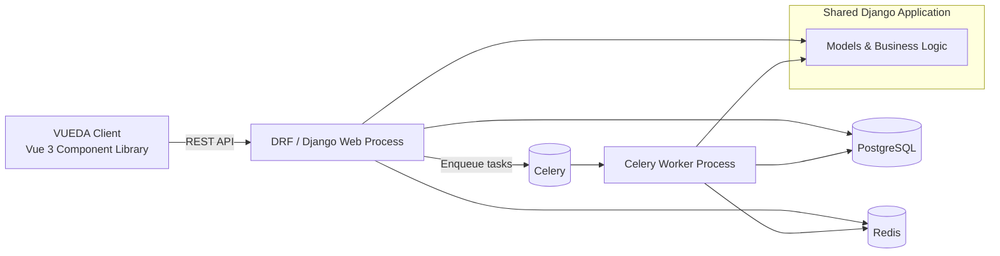

# Implementor Guide

<!--prettier-ignore-start-->
<!--TOC-->

- [Implementor Guide](#implementor-guide)
  - [Introduction](#introduction)
  - [Architecture Overview](#architecture-overview)
  - [Design Principles](#design-principles)
    - [Server-Side Principles](#server-side-principles)
    - [Client-Side Principles](#client-side-principles)
  - [Key Concepts](#key-concepts)
    - [Server-Side Concepts](#server-side-concepts)
      - [Models and Serializers](#models-and-serializers)
      - [Permissions and Authentication](#permissions-and-authentication)
      - [Views and ViewSets](#views-and-viewsets)
      - [Routing and URLs](#routing-and-urls)
      - [Filters and Search](#filters-and-search)
      - [Flexfields and Pagination](#flexfields-and-pagination)
    - [Client-Side Concepts](#client-side-concepts)
      - [Components and Composition API](#components-and-composition-api)
      - [State Management](#state-management)
      - [API Interaction](#api-interaction)
      - [Theming and Customization](#theming-and-customization)
  - [Server-Client Contract](#server-client-contract)
    - [Primary Key (PK) Discipline](#primary-key-pk-discipline)
  - [Customization and Extensibility](#customization-and-extensibility)
    - [Server-Side Customization](#server-side-customization)
    - [Client-Side Customization](#client-side-customization)
  - [Opinionated Defaults](#opinionated-defaults)
  - [Permissions, Security, and Trust Boundaries](#permissions-security-and-trust-boundaries)

<!--TOC-->
<!--prettier-ignore-end-->

## Introduction

VUEDA is a server-side & client-side framework designed to simplify the development of 
custom, django-admin-like interfaces using modern web technologies. This guide provides an overview of the key concepts,
architecture, and implementation details to help developers effectively utilize VUEDA in their projects. It is intended
for developers who want to use VUEDA in their Django Rest Framework applications and their Vue.js frontends.

This document assumes familiarity with Python, JavaScript, Django, Django Rest Framework, Vue.js, and general web
development concepts.
- [Getting started modules - Learn web development | MDN](https://developer.mozilla.org/en-US/docs/Learn_web_development/Getting_started)
- [JavaScript | MDN](https://developer.mozilla.org/en-US/docs/Web/JavaScript)
- [Our Documentation | Python.org](https://www.python.org/doc/)
- [Django documentation | Django](https://docs.djangoproject.com/en/5.2/)
- [Quickstart - Django REST framework](https://www.django-rest-framework.org/tutorial/quickstart/)
- [Introduction | Vue.js](https://vuejs.org/guide/introduction)
- [Index | Node.js Documentation](https://nodejs.org/docs/latest/api/)

**If you are looking to get a basic VUEDA setup running quickly, please refer to the [VUEDA Quick Start Guide](./getting-started.md).**

## Architecture Overview

VUEDA consists of two main components:
1. **Server-Side (VUEDA Server)**: Built on Django and Django Rest Framework, this component provides the backend API,
data models, and business logic. It handles data storage, retrieval, and processing. It handles user authentication,
permissions, and exposes RESTful endpoints for client consumption. It uses PostgreSQL as the primary database, Redis for
caching, and Celery for background task processing.
2. **Client-Side (VUEDA Client)**: A Vue 3 component library that interacts with the VUEDA Server API to render dynamic
user interfaces. It provides reusable components for forms, tables, and other UI elements. It is based on our
`@arrai-innovations/reactive-helpers` package, which provides reactive utilities for Vue.js's Composition API and other
JavaScript utilities.

## Design Principles

### Server-Side Principles

- **Base‑class centralization**: shared behavior lives in `VuedaBaseModel`, `VuedaSerializer`, and `VuedaViewSet`; extensions happen via
  mixins rather than ad‑hoc overrides.
- **Strict input hygiene**: reject unknown fields and query params by default (`NoExtraFieldsSerializerMixin`,
  `NoExtraFieldsForViewSetMixin`) to keep API contracts tight.
- **Explicit expand/sparse control**: flex‑field expansion is allowed only when declared and validated; expansion metadata is curated
  in serializer context.
- **Transaction safety by default**: create/update/destroy operations are wrapped in atomic transactions.
- **Row‑level permission filtering**: list endpoints apply row‑level access filtering inside viewsets, not just at the queryset
  boundary.
- **Action‑scoped serializer behavior**: viewsets can use per‑action serializer classes to formalize read/write differences.
- **Predictable bulk semantics**: bulk destroy/activate/deactivate flows are standardized and validate primary keys rigorously.
- **Validation errors are structured**: server raises `VuedaValidationError` with field‑keyed error payloads for client consumption.

### Client-Side Principles

- **Composition-first API**: behavior is built from composables and small helpers rather than inheritance.
- **State-first contract**: composables return `state` plus operations; consumers can observe or act independently.
- **Explicit state transitions**: loading/error/errored flags are first-class and consistently wired.
- **Safe reactivity boundaries**: `readonly`/`shallowReadonly`, `markRaw`, and `effectScope` limit accidental deep reactivity and
  ensure cleanup.
- **Stable state shapes**: default object shapes are created up front to keep templates predictable and reactive.
- **Cancellable async flows**: requests expose `cancel()` and avoid duplicate in-flight work.
- **Deterministic slot + naming conventions**: derived slot names and field paths define extension points.
- **JSDoc-driven typing**: rich typedefs make JS composables ergonomic for TS consumers.

## Key Concepts

### Server-Side Concepts

#### Models and Serializers

#### Permissions and Authentication

#### Views and ViewSets

#### Routing and URLs

#### Filters and Search

#### Flexfields and Pagination

### Client-Side Concepts

<!-- todo: client-side key concepts -->

#### Components and Composition API

#### State Management

#### API Interaction

#### Theming and Customization

## Server-Client Contract

VUEDA establishes a clear contract between the server and client components through RESTful APIs.

### Primary Key (PK) Discipline

- **Client‑side representation:** PKs are treated as strings in the client to match JS object key semantics and Vue reactivity
  patterns.
- **Server‑side representation:** PKs remain integers, following Django conventions.
- **Over‑the‑wire:** Currently mixed. Some endpoints return numeric PKs, while others return strings.
- **Contract goal:** Standardize API responses to **always return PKs as strings**, and accept either string or integer input. This
  keeps client code stable while remaining server‑friendly.
- **Client behavior today:** Reactive helpers coerce to strings in list/object state handlers; CRUD calls may need explicit
  conversion before sending.

<!-- todo:
Shape of API responses beyond pure data:
- Field metadata
- Validation rules
- Permissions
- Available actions
- Naming conventions and guarantees
- How backward compatibility is handled
- Versioning expectations

Answer questions like:
- Can the client assume fields are stable?
- Are unknown fields safe to ignore?
- Are actions discoverable or hardcoded?
-->

## Customization and Extensibility

### Server-Side Customization

<!-- todo:
For each extension point:
- What problem it exists to solve
- When to use it vs alternatives
- Lifecycle hooks
- Anti-patterns

Examples:
- Custom serializers vs serializer mixins
- ViewSet augmentation vs composition
- Policy/permission injection
- Metadata providers

Be explicit about:
- "This looks tempting but will break X"
- "Do not override Y unless you also do Z"
-->

### Client-Side Customization

<!-- todo:
Document:
- When to create a new component vs extend an existing one
- Slot patterns provided by VUEDA components
- Component composition rules
- Store augmentation patterns
-->

## Opinionated Defaults

<!-- todo:
Document:
- Default pagination behavior
- Filtering/search conventions
- Error handling and normalization
- Loading and optimistic updates
- Form generation rules
- Validation timing (client vs server)

For each:
- Why this default exists
- What breaks if you change it
- How to override it safely
-->

## Permissions, Security, and Trust Boundaries

<!-- todo:
- Server is always authoritative
- How permissions are enforced on the server
- How permissions are communicated to the client
- What the client can and cannot assume about permissions
- Audit/logging considerations
Anti-patterns:
- Client-side using server permissions for UI logic
- Trusting client data for server operations
-->
