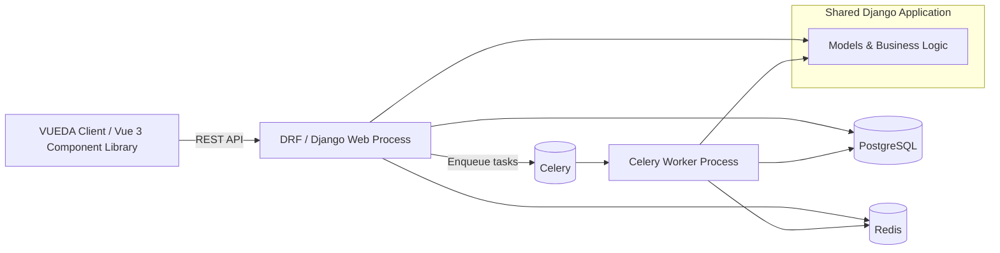

# Architecture

VUEDA is a server-side & client-side framework for building custom, Django-admin-like interfaces.

## Components

- **VUEDA Server**: Django + Django REST Framework APIs, authentication/permissions, and domain logic.
- **VUEDA Client**: Vue 3 component library that consumes the VUEDA Server contract.

## High-Level Data Flow

## Next

- [Design Principles](design-principles.md)
- [Server-Client Contract](server-client-contract.md)

